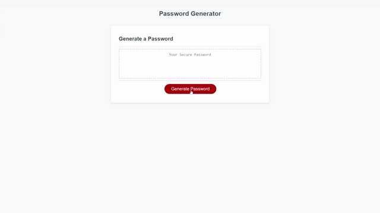

# Password-Generator

Here we have created a random password generator functions while the webpage and design was pre-set. This generator will ask input for how many characters they would like to include with parameters asking for certain characteristics they may need. Once all selections have been made by the user through the window confirms, password will be generated in center box successfully.

## Installation

Visit repo Password-Generator from GitHub and clone the repo using either SSH or HTTPs. Once cloned to desired folder, user has access to updates and full visibility to all code. User can also follow link here as well:

https://github.com/jonathan-lee8/Password-Generator

## Usage

User can access this generator to generate a random password under certain characteristics set by the user.

## Credits

N/A

## License

MIT License

